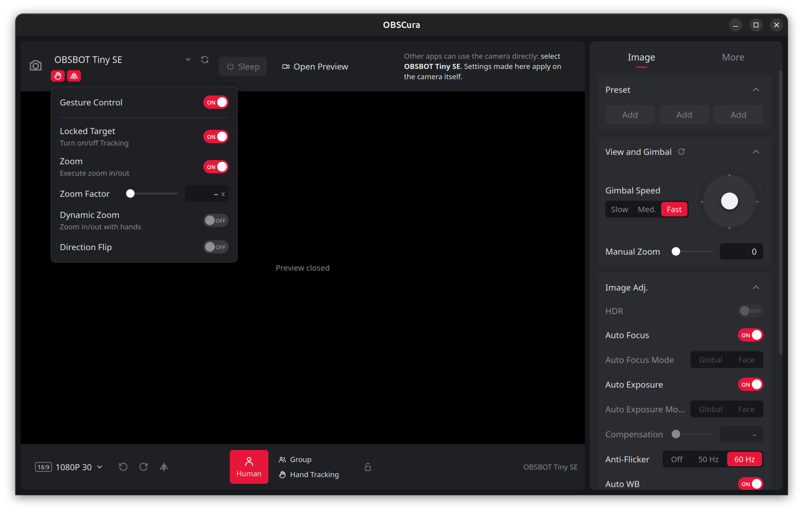
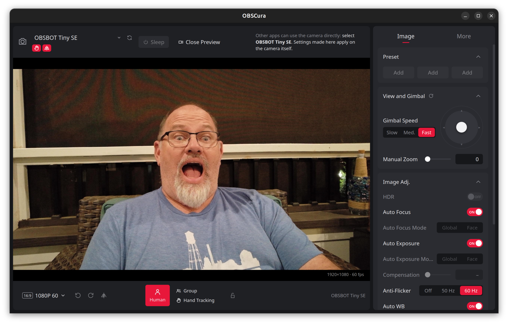

# OBSCura

[](https://github.com/kenvandine/obscura/actions/workflows/ci.yml)
[](https://github.com/kenvandine/obscura/actions/workflows/snap.yml)

**OBSCura: Unofficial control panel for OBSBOT webcams.**

A Linux configuration tool for OBSBOT webcams: AI tracking,
gesture control, gimbal, mirror and image settings, with a live preview.
Built with Rust, Tauri 2 and Svelte.

OBSBOT's own *OBSBOT Center* only runs on Windows and macOS. On Linux the
cameras work as plain UVC webcams, but their AI and gimbal features can't be
changed. This project talks to the camera the same way the official app does,
using a vendor protocol reverse-engineered from USB captures.

> **Not affiliated with OBSBOT / Remo Tech.** "OBSBOT" is their trademark.
> This project was written without any vendor documentation or SDK. Use it
> at your own risk.

<p align="center">
  
  
</p>

## Contents

- [Supported cameras](#supported-cameras)
- [Features](#features)
- [Installing](#installing)
- [Using the app](#using-the-app)
- [Using the CLI (`obsbotctl`)](#using-the-cli-obsbotctl)
- [How it works](#how-it-works)
- [Adding support for another camera](#adding-support-for-another-camera)
- [Development](#development)
- [Troubleshooting](#troubleshooting)
- [License](#license)

## Supported cameras

| Camera | USB ID | Status |
|---|---|---|
| OBSBOT Tiny SE | `3564:feff` | Supported (firmware 6.4.4.1) |
| Other OBSBOT models | `3564:*` | Standard UVC controls only (see below) |
| Any other UVC webcam | – | Standard UVC controls, with `--all` / `OBSBOT_ALL_CAMERAS=1` |

Other OBSBOT models (Tiny 2, Tiny 2 Lite, Meet 2, …) are detected and get
the standard webcam controls. Their vendor features stay disabled until
someone contributes USB captures, because command IDs and status layouts
may differ between models. Adding a model means adding one profile file;
see [Adding support for another camera](#adding-support-for-another-camera).

## Features

Status on the Tiny SE:

| Area | Feature | Status |
|---|---|---|
| AI tracking | Human / Group / Hand Tracking modes | ✅ |
| Gesture control | Master switch, Locked Target, Zoom, Dynamic Zoom, Direction Flip, Zoom Factor (1–4×) | ✅ ¹ |
| View & gimbal | Joystick (velocity control), speed, view reset | ✅ |
| View & gimbal | Manual zoom | ✅ (raw 0–12 steps for now) |
| Image | Mirror image (on the camera, so every app sees it) | ✅ |
| Image | Brightness, contrast, saturation, sharpness, hue | ✅ |
| Image | Auto/manual focus, auto/manual exposure, gain, white balance, anti-flicker | ✅ |
| Preview | Live MJPEG preview, 1080p/720p at 30/60 fps | ✅ |
| Device | Hot-plug and reboot recovery | ✅ |
| Panel | Tray indicator with quick toggles and show/hide | ✅ |
| Pending captures | Sleep/wake, HDR, face-priority AF/AE, presets, portrait mode, rotate, audio, auto-sleep, status light, gimbal reverse, factory reset | 🚧 greyed out |
| Out of scope | Beauty/background effects, recording, firmware updates | ❌ ² |

¹ The camera doesn't report the gesture sub-switches or the zoom factor in its
status block, so the app shows the value you last set.
² In OBSBOT Center these effects run on the PC, not the camera. Firmware
flashing is deliberately never implemented.

Controls that aren't supported yet are still shown, greyed out, with a tooltip
explaining why. The layout matches the official app.

## Installing

[](https://snapcraft.io/obscura)
[](https://snapcraft.io/obscura)

### Snap (strictly confined)

```sh
sudo snap install obscura
sudo snap connect obscura:camera                 # required
sudo snap connect obscura:hardware-observe       # optional: USB product name/serial
sudo snap alias obscura.obsbotctl obsbotctl      # optional: plain `obsbotctl`
```

The snap uses the GNOME 46 runtime (which provides WebKitGTK), and only
needs the `camera` interface to reach the camera. It never needs raw USB
access.

### From source

#### 1. Dependencies

Rust (stable, 1.77.2+), Node.js 20.19+ or 22.12+, [pnpm](https://pnpm.io/), and the
[Tauri Linux prerequisites](https://v2.tauri.app/start/prerequisites/#linux).
On Debian/Ubuntu:

```sh
sudo apt install libwebkit2gtk-4.1-dev build-essential curl wget file \
    libxdo-dev libssl-dev libayatana-appindicator3-dev librsvg2-dev
```

#### 2. Build

```sh
git clone https://github.com/kenvandine/obscura.git
cd obscura

# CLI only
cargo build --release -p obsbotctl        # -> target/release/obsbotctl
cargo build --release -p obscura-indicator  # -> target/release/obscura-indicator

# Desktop app (+ .deb and AppImage bundles)
cd app
pnpm install
pnpm tauri build                         # -> target/release/obscura
                                         #    target/release/bundle/{deb,appimage}/
```

#### 3. Permissions

Everything goes through `/dev/videoN`, so no root access, udev rules or kernel
modules are needed. On desktop distributions the logged-in user can already
open the camera. On other setups, add yourself to the `video` group:

```sh
sudo usermod -aG video "$USER"   # then log out and back in
```

## Using the app

Run `obscura` (or `pnpm tauri dev` from `app/` during development).

- **Top bar:** camera picker, the Gesture Control and Mirror Image popovers,
  Sleep/Resume, and Open/Close Preview.
- **Preview:** a live view from the camera. Choose resolution and frame rate
  from the format button at the bottom left.
- **Bottom bar:** AI tracking modes (Human / Group / Hand Tracking) and the
  AI lock.
- **Image tab:** presets, the gimbal joystick and zoom, and image adjustments.
- **More tab:** audio, device sleep, status light, other settings, and device
  details.

Settings are written to the camera itself, so they apply to every app that
uses it (Zoom, Meet, OBS, …). You don't need to keep OBSCura running.

Only one application can stream from the camera at a time. **Close the preview
before joining a call**; the controls keep working while another app is
streaming.

### Panel indicator

`obscura-indicator` (`obscura.indicator` in the snap) is a tiny tray icon,
using about 4 MiB and showing the app's icon, that you can leave running all
the time. Its menu offers:

- **Show / Hide OBSCura**: starts the full app, and quits it again, so the
  heavy GUI only uses memory while it's open.
- **AI tracking**: Off, Human, Group or Hand tracking.
- **Gesture control** and **Mirror image** on/off.
- **Re-center camera**.
- **Start at login**: the indicator's autostart entry (inside the snap,
  snapd's per-app autostart). It's on by default after first launch, and can
  also be switched in the app under **More → Panel Indicator**.

The app and the indicator run together. Starting OBSCura, from the indicator
or directly, also starts the indicator if it isn't already running. When you
close the app, the indicator keeps running if **Start at login** is on, and
quits with the app if it's off.

The menu re-reads the camera each time it opens, so it reflects changes made
with gestures or in the app. It uses no GTK or webview: the desktop shell
draws the menu over D-Bus (StatusNotifierItem). On GNOME this needs the
AppIndicator extension, which Ubuntu enables by default.

To try the app without an OBSBOT camera, using another webcam's standard
controls:

```sh
OBSBOT_ALL_CAMERAS=1 obscura
```

## Using the CLI (`obsbotctl`)

```sh
obsbotctl list                     # connected cameras (--all for non-OBSBOT)
obsbotctl info                     # USB details and the matched profile
obsbotctl dump                     # every supported feature and its value
obsbotctl dump --unsupported       # ...including the unsupported ones and why
obsbotctl dump --json

obsbotctl get ai_mode
obsbotctl set ai_mode human        # off | human | group | "hand tracking"
obsbotctl set gesture_control on
obsbotctl set gesture_zoom_factor 2.5
obsbotctl set mirror_image off
obsbotctl set contrast 60
obsbotctl set white_balance_temperature 4800K
obsbotctl set anti_flicker "50 Hz"

obsbotctl gimbal 0.5 0 --ms 800    # pan right at half speed for 0.8 s
obsbotctl gimbal 0 -1 --ms 300     # tilt down at full speed

obsbotctl controls                 # raw V4L2 controls exposed by the driver
```

Global options: `-d /dev/videoN` selects a camera, and `--all` includes
non-OBSBOT cameras. Values are parsed per feature: `on`/`off` for switches,
labels or numbers for choices, and numbers in display units for ranges
(`1.5` for 1.5× zoom, `4800K` for white balance).

There is also a hidden `obsbotctl raw` command for low-level Extension Unit
access, used during reverse engineering. **Only replay commands you have seen
in captures.** The camera has crashed and rebooted from malformed commands.

## How it works

```
┌────────────────────┐   ┌──────────┐
│ app/ (Tauri+Svelte)│   │ obsbotctl│
└─────────┬──────────┘   └────┬─────┘
          └──────┬────────────┘
         ┌───────▼────────┐    profiles/*.toml
         │  obsbot-core   │◄── (per-model feature bindings)
         └───────┬────────┘
     ┌───────────┼─────────────────┬───────────────────┐
  V4L2 controls  UVC XU (unit 2)   UVC XU (unit 2)     V4L2 streaming
  VIDIOC_S_CTRL  selector 2:       selector 6:         (MJPEG preview)
                 framed commands   settings + status
```

- **Standard controls** (image, focus, exposure, white balance, pan/tilt/zoom)
  are ordinary UVC controls, exposed by the `uvcvideo` driver as V4L2 controls.
- **Vendor features** go through the camera's UVC *Extension Unit* (unit 2,
  GUID `9a1e7291-6843-4683-6d92-39bc7906ee49`) via the `UVCIOC_CTRL_QUERY`
  ioctl, which works while another application is streaming:
  - **Selector 2** carries 60-byte framed commands with two CRC-16/USB
    checksums (the camera silently drops frames with a bad checksum).
  - **Selector 6** takes short `[id, len, value]` settings, and reading it
    returns a status block reflecting the current state.
- **Profiles** (`profiles/*.toml`) map each catalog feature to a transport
  binding, so supporting a new model is data, not code.
- **Preview** captures MJPEG on its own file handle and sends JPEG bytes to the
  webview over a Tauri channel, with flow control so frames drop rather than
  queue.

The full protocol write-up is in [`docs/protocol.md`](docs/protocol.md).

### Repository layout

| Path | Contents |
|---|---|
| `crates/obsbot-core/` | Library: discovery, V4L2/XU transports, vendor protocol, profiles, preview |
| `crates/obsbotctl/` | Command-line tool |
| `crates/obscura-indicator/` | Lightweight tray indicator |
| `app/` | Tauri 2 desktop app: Rust backend in `src-tauri/`, Svelte 5 frontend in `src/` |
| `profiles/` | Per-model device profiles (compiled into the binaries) |
| `docs/protocol.md` | Decoded vendor protocol |
| `docs/CAPTURING.md` | How to capture OBSBOT Center's USB traffic on Windows |
| `tools/obsbot_pcap.py` | Decoder for USBPcap captures |

## Adding support for another camera

1. **Capture** OBSBOT Center's USB traffic on Windows while using each feature,
   following [`docs/CAPTURING.md`](docs/CAPTURING.md).
2. **Decode** the captures:

   ```sh
   python3 tools/obsbot_pcap.py captures/10-gesture-master.pcapng
   ```

   This prints each command with its destination, command ID and payload, and
   only the bytes of the polled status block that changed.
3. **Write a profile** in `profiles/<model>.toml`, starting from
   [`profiles/tiny-se.toml`](profiles/tiny-se.toml). Match it by USB ID,
   inherit the standard controls, and bind features:

   ```toml
   id = "tiny-2"
   name = "OBSBOT Tiny 2"
   inherits = "generic-uvc"

   [[match]]
   vendor_id = 0x3564
   product_id = 0x....

   [features.mirror_image]
   status = 19                  # byte in the selector 6 status block
   short = { id = 0x14 }        # selector 6 setting [0x14, len, value]

   [features.gesture_locked_target]
   frames = [{ dst = 0x04, cmd = "c430" }]   # selector 2 framed command
   ```

4. **Register** the file in `BUILTIN` in `crates/obsbot-core/src/profile.rs`,
   and add a test that encodes a command and compares it byte-for-byte with a
   captured packet (see `crates/obsbot-core/src/protocol.rs`).

Pull requests with captures and profiles for other models are very welcome.
Please leave the raw `.pcapng` files out of the repository: they're large and
contain video frames. Only commit the decoded evidence in `docs/protocol.md`.

## Development

```sh
cargo test                         # protocol encoders vs captured packets, profiles, parsing
cargo build                        # workspace: obsbot-core, obsbotctl, obscura
cd app && pnpm check               # Svelte/TypeScript type checking
cd app && pnpm tauri dev           # run the app with hot reload
```

### Continuous integration and releases

- **CI** (`.github/workflows/ci.yml`) runs on every push and pull request:
  `cargo fmt --check`, `clippy -D warnings`, `cargo test`, `svelte-check`
  and a frontend build.
- **Snap** (`.github/workflows/snap.yml`) builds the snap natively on amd64
  and arm64. Pull requests get the snaps as downloadable artifacts. Pushes to
  `main` publish both architectures to the **candidate** channel, from which
  they can be promoted to stable:

  ```sh
  snapcraft release obscura <revision> stable
  ```

  Publishing uses a `SNAPCRAFT_STORE_CREDENTIALS` repository secret, created
  with:

  ```sh
  snapcraft export-login --snaps obscura --channels candidate \
    --acls package_access,package_push,package_update,package_release -
  ```

The dev watcher doesn't track `profiles/`. Restart `pnpm tauri dev` after
editing a profile.

## Troubleshooting

**"No OBSBOT camera found"**: check that `obsbotctl list --all` shows the
camera and that you can open `/dev/videoN` (see
[Permissions](#3-permissions)).

**"The camera is in use by another application"**: another app is streaming.
Close it, or close this app's preview; settings still work either way.

**A setting flips back for a moment**: the camera updates its status block
about a second after a command. The app hides this lag, but the CLI's `dump`
can show the old value if run immediately after a `set`.

**`Corrupt JPEG data: … extraneous bytes before marker` in the terminal**:
harmless. It's WebKit's JPEG decoder complaining about padding in the camera's
MJPEG frames.

**Blank window or rendering glitches on some GPUs**: try
`WEBKIT_DISABLE_DMABUF_RENDERER=1 obscura`.

**The camera disappears from USB**: it can reboot after an invalid vendor
command, and comes back after about 40 seconds. The app reconnects on its own.

## License

Copyright © 2026 Ken VanDine

This program is free software: you can redistribute it and/or modify it under
the terms of the GNU General Public License as published by the Free Software
Foundation, either version 3 of the License, or (at your option) any later
version. See [LICENSE](LICENSE) for the full text.
